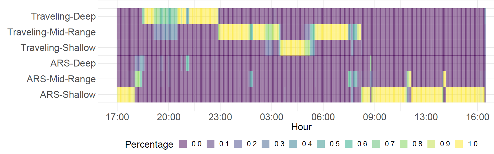

```{r setup, include=FALSE}
knitr::opts_chunk$set(echo = TRUE)
```

## moveHMM

moveHMM is an R package to process positional data, for visualization, and to fit hidden Markov models (HMMs) in a maximum likelihood setting. Accompanying Methods in Ecology and Evolution paper here: https://besjournals.onlinelibrary.wiley.com/doi/full/10.1111/2041-210X.12578

We'll do a run through of how moveHMM can be used to analyze positional data. Because of time constraints, we won't get into momentuHMM but do check it out: https://besjournals.onlinelibrary.wiley.com/doi/full/10.1111/2041-210X.12995

```{r packages, message=FALSE, warning=FALSE}
library(moveHMM)
```

Let's look at some elk data (in the moveHMM package): 

```{r}
head(elk_data)

elk_data$Easting <- elk_data$Easting/1000
elk_data$Northing <- elk_data$Northing/1000

```

Notice that there is no timestamp, but the assumption here is that the observations were collected regularly (time between data points collected is the same). 

We'll now `process` the data as needed to fit the HMM, as formulated in the moveHMM package. This means transforming the coordinates to `step length` and `turning angle`. 

```{r}
data <- prepData(elk_data,type="UTM",coordNames=c("Easting","Northing"))
head(data)
```

moveHMM also provides a way to quickly look at a summary of the data, including the number of animals included and the number of observations for each: 

```{r}
summary(data)
```

We can also visualize the data by using the `plot()` function: 

```{r}
plot(data,compact=T)
```

Let's fit a 2-state HMM: 

```{r}

#------------------------------------------------------------------------------
## standardize covariate values -- important for mulinomial logistic function
data$dist_water <-
(data$dist_water-mean(data$dist_water))/sd(data$dist_water)

#------------------------------------------------------------------------------
## initial parameters for gamma and von Mises distributions
mu0 <- c(0.1,1) # step mean (two parameters: one for each state)
sigma0 <- c(0.1,1) # step SD
zeromass0 <- c(0.1,0.05) # step zero-mass
stepPar0 <- c(mu0,sigma0,zeromass0)
angleMean0 <- c(pi,0) # angle mean
kappa0 <- c(1,1) # angle concentration
anglePar0 <- c(angleMean0,kappa0)

#------------------------------------------------------------------------------
## call to fitting function
m <- fitHMM(data=data,nbStates=2,stepPar0=stepPar0,
anglePar0=anglePar0,formula=~dist_water)

```

```{r}
# looking at the output

print(m)
CI(m) ## limitations here
plot(m, plotCI=TRUE)

```

```{r}
sp <- stateProbs(m)
head(sp)
plotStates(m,animals="elk-115")
```

Other options for state decoding: Viterbi (the most likely state sequence). 

```{r}
plotStationary(m, plotCI=TRUE)
```

Residuals: 

```{r}
# compute the pseudo-residuals
pr <- pseudoRes(m)
# time series, qq-plots, and ACF of the pseudo-residuals
plotPR(m)
```

## Stan 

Stan is a probabilistic programming language and a platform for statistical modeling and high-performance statistical computation in order to conduct Bayesian inference using HMC (and more). I am biased towards Stan (https://mc-stan.org/ -- I really love Hamiltonian Monte Carlo: HMC), and as a good Bayesian, I make sure to reveal my biases _a priori_. 

We'll redo the elk example in a Bayesian framework now using the data processed with moveHMM. 

```{r, eval=F}

library(rstan)
options(mc.cores = parallel::detectCores())
rstan_options(auto_write = TRUE)

#Stan can't handle NAs
data$step[is.na(data$step)] <- -100
data$angle[is.na(data$angle)] <- -100

stan.data <- list(T = dim(data)[1], 
                  ID = as.numeric(as.factor(data$ID)), 
                  steps = data$step, 
                  angles = data$angle, 
                  N = 2)

fit <- stan("StepTurnHMM_NoCovariates.stan", data=stan.data)


```

The Stan code is a bit long, but let's take a look nonetheless: 


```{stan, output.var="ex11", eval=F}
//code written with Théo Michelot (University of St Andrews)
data {
    int<lower=0> T; // length of the time series
    int ID[T]; // track identifier
    vector[T] steps; // step lengths
    vector[T] angles; // turning angles
    int<lower=1> N; // number of states
}

parameters {
    positive_ordered[N] mu; // mean of gamma - ordered
    vector<lower=0>[N] sigma; // SD of gamma
    // unconstrained angle parameters
    vector[N] xangle;
    vector[N] yangle;
    //tpm
    simplex[N] gamma[N];
}  

transformed parameters {
    vector<lower=0>[N] shape;
    vector<lower=0>[N] rate;
    vector<lower=-pi(),upper=pi()>[N] loc;
    vector<lower=0>[N] kappa;

    
    // derive turning angle mean and concentration
    for(n in 1:N) {
        loc[n] = atan2(yangle[n], xangle[n]);
        kappa[n] = sqrt(xangle[n]*xangle[n] + yangle[n]*yangle[n]);
    }
    
    // transform mean and SD to shape and rate
    for(n in 1:N)
        shape[n] = mu[n]*mu[n]/(sigma[n]*sigma[n]);
    
    for(n in 1:N)
        rate[n] = mu[n]/(sigma[n]*sigma[n]);
}

model {
    vector[N] logp;
    vector[N] logptemp;
    matrix[N,N] log_gamma_tr;
    
    // priors
    mu[1] ~ normal(1, 1);
    mu[2] ~ normal(5, 1);
    sigma ~ student_t(3, 0, 1);
    xangle[1] ~ normal(-0.5, 1); // equiv to concentration when yangle = 0
    xangle[2] ~ normal(2, 2);
    yangle ~ normal(0, 0.5); // zero if mean angle is 0 or pi
      
    // transpose
    for(i in 1:N)
        for(j in 1:N)
            log_gamma_tr[j,i] = log(gamma[i,j]);

    // likelihood computation
    for (t in 1:T) {
        // initialise forward variable if first obs of track
        if(t==1 || ID[t]!=ID[t-1])
            logp = rep_vector(-log(N), N);
        
        for (n in 1:N) {
            logptemp[n] = log_sum_exp(to_vector(log_gamma_tr[n]) + logp);
            
            //to account for missing values
            if(steps[t]>=0)
                logptemp[n] = logptemp[n] + gamma_lpdf(steps[t] | shape[n], rate[n]);           
            //to account for missing values    
            if(angles[t]>=(-pi()))
                logptemp[n] = logptemp[n] + von_mises_lpdf(angles[t] | loc[n], kappa[n]);    
        }
        logp = logptemp;
        
        // add log forward variable to target at the end of each track
        if(t==T || ID[t+1]!=ID[t])
            target += log_sum_exp(logp);
    }
}


```

We can then look at the output of the MCMC chains of the Stan object: 

```{r, eval=F}
print(fit)
```


We would then use the joint posterior draws of the parameters to obtain draws from the joint posterior state draws. An example plot of posterior state draws: 



### Continuous-valued random effects for individuals 

Example Stan code on github: https://github.com/vianeylb/WhiteSharkGuadalupe/blob/master/WhiteShark_StepTurn_RandEff.stan

```{stan, output.var="ex2", eval=F}
data {
  
  // OBSERVATION PROCESS
  
  int<lower=1> Tlen; // length of the observations across all individuals
  vector[Tlen] ID; // ID for individual tracks
  vector[Tlen] steps; // steps for all sharks
  vector[Tlen] angles; // angles for all sharks

  // STATE PROCESS

  int<lower=1> N_gps; // number of states for steps/turns


  //hierarchical steps
  int<lower=1> NindivID; // individual IDs
  int<lower=1, upper=NindivID> indivID[Tlen]; // individual IDs
}

parameters {
  
  // STEPS
  positive_ordered[N_gps] mu_step_hier; // mean of gamma - ordered
  vector<lower=0>[N_gps] sigma_mu_step_hier; // SD of gamma
  positive_ordered[N_gps] mu_step[NindivID];
  positive_ordered[N_gps] sigma_step;  
  
  // ANGLES
  // unconstrained angle parameters
  vector[N_gps] xangle;
  vector[N_gps] yangle;

  simplex[N_gps] initdist; // initial distribution for fine scale movements
  
  simplex[N_gps] moveTPM[N_gps]; 
}


transformed parameters {
  
  // shapes and rates for the state-dependent distributions for steps
  vector[N_gps] shape[NindivID]; 
  vector[N_gps] rate[NindivID];
  
  // constrained parameters for turning angle distributions
  vector[N_gps] kappa = sqrt(xangle .* xangle + yangle .* yangle);  
  vector[N_gps] loc;

  
  for(n in 1:N_gps){
    loc[n] = atan2(yangle[n], xangle[n]);
  }
  
  for(n in 1:NindivID){
    shape[n] = mu_step[n] .* mu_step[n] ./ (sigma_step .* sigma_step);
    rate[n] = mu_step[n] ./ (sigma_step .* sigma_step);
  }
  
}


model {
  
  
  // for the forward algorithm
  vector[N_gps] logp;
  vector[N_gps] logptemp;
  
  // transition probability matrix
  matrix[N_gps,N_gps] log_tpm_tr_move;

  // transpose
  for(i in 1:N_gps)
    for(j in 1:N_gps)
      log_tpm_tr_move[j,i] = log(moveTPM[i,j]);

  
  // -----------------------------------------
  // PRIORS
  // -----------------------------------------
  
  // steps - in meters
  // for 5 min period
  mu_step_hier[1] ~ normal(50, 5);
  mu_step_hier[2] ~ normal(150, 10);
  mu_step_hier[3] ~ normal(250, 10);
  sigma_mu_step_hier ~ student_t(3, 0, 1);
  sigma_step ~ student_t(3, 0, 1);

  // angles
  xangle[1] ~ normal(-0.5, 1); // equiv to concentration when yangle = 0
  xangle[2] ~ normal(2, 2);
  xangle[3] ~ normal(0, 1);
  yangle ~ normal(0, 0.5);

  for(i in 1:NindivID){
    mu_step[i] ~ normal(mu_step_hier, sigma_mu_step_hier);
  }
  
  // FORWARD ALGORITHM

    // likelihood computation
    for (t in 1:Tlen) {
        // initialise forward variable if first obs of track
        if(t==1 || ID[t]!=ID[t-1]){
          logptemp = initdist;     
            for(n in 1:N_gps){
            if(steps[t]>=0) 
                logptemp[n] = logptemp[n] + gamma_lpdf(steps[t] | shape[indivID[t],n], rate[indivID[t],n]);
            if(angles[t] >= -pi())
                logptemp[n] = logptemp[n] + von_mises_lpdf(angles[t] | loc[n], kappa[n]);
          }
        } else {
          for (n in 1:N_gps) {
            logptemp[n] = log_sum_exp(to_vector(log_tpm_tr_move[n]) + logp);
            if(steps[t]>=0) 
                logptemp[n] = logptemp[n] + gamma_lpdf(steps[t] | shape[indivID[t],n], rate[indivID[t],n]);
            if(angles[t] >= -pi())
                logptemp[n] = logptemp[n] + von_mises_lpdf(angles[t] | loc[n], kappa[n]);
          }
        }
        logp = logptemp;
        
        // add log forward variable to target at the end of each track
        if(t==Tlen || ID[t+1]!=ID[t])
            target += log_sum_exp(logp);
    }

}


```

### HMMs in Stan!!!!!! 

So....up to this point, to fit an HMM in Stan you had to program the so-called forward algorithm that marginalizes over the discrete random variables. You won't have to do that soon!! 

```{stan, output.var="exnew", eval=F}
data {
  int<lower = 0> N;  // number of states
  int<lower = 1> T;  // number of observations
  real y[T];
}

parameters {
  simplex[N] theta[N];  // N x N tp
  ordered[N] mu;  // state-dependent parameters
  simplex[N] init;
}

transformed parameters {
  matrix[N, T] log_omega;
  matrix[N, N] Gamma;

  // build log_omega
  for (t in 1:T)
    for (n in 1:N) log_omega[n, t] = normal_lpdf(y[t] | mu[n], 2);

  // build Gamma
  for (n in 1:N) Gamma[n, ] = theta[n]';
}

model {
  mu ~ student_t(3, 0, 1);
  
  target += hmm_marginal(log_omega, Gamma, init);
}
```


And, there will be built in functionality to extract the marginal state probabilites and joint posterior state draws. 

Big shout outs to Michael Betancourt and Charles Margossian, and many others on the Stan team, for doing this. 

## Extra -- Stan Ecology

Check out the Stan Ecology community page at: https://stanecology.github.io/ 